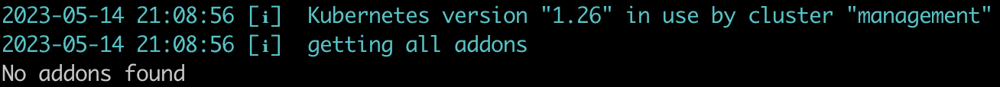
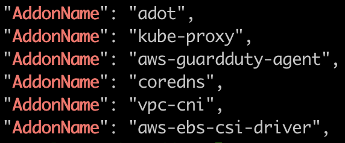
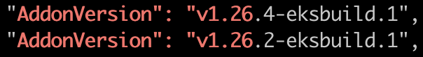
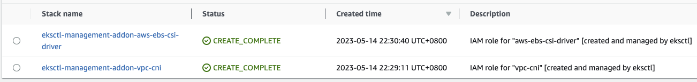
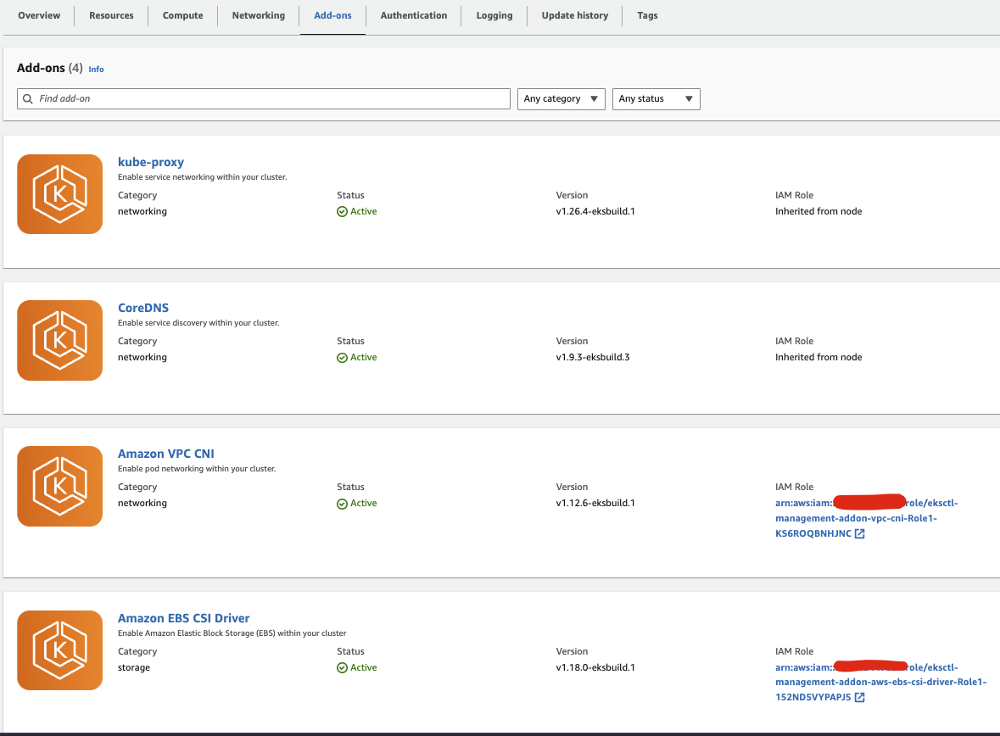

# Default Amazon EKS add-ons

There are 3 default add-ons that get contained in each EKS cluster:
+ kube-proxy
+ vpc-cni (aws-node)
+ coredns

The above add-ons use the self-managed type by default.

AWS recommends adding `the Amazon EKS type` of add-ons to our clusters instead of using the self-managed type of add-ons.

Once an EKS cluster is created, we can use **eksctl** to determine the current `the Amazon EKS type` of add-ons and their versions installed on the cluster.
```
eksctl get addon --cluster management --region us-west-2
```


## Create the Amazon EKS type of add-ons manually
View the names of add-ons available:
```
export EKS_VERSION=1.26
eksctl utils describe-addon-versions --kubernetes-version $EKS_VERSION | grep AddonName
```


View the versions available for add-ons. Replace `name-of-addon` with the name of the add-on you'd like to view the versions for.
```
export EKS_VERSION=1.26
eksctl utils describe-addon-versions --kubernetes-version $EKS_VERSION --name name-of-addon | grep "AddonVersion.*${EKS_VERSION}"
```
The picture below is for kube-proxy:



+ kube-proxy
```
eksctl create addon --cluster management --name kube-proxy
```

+ vpc-cni
```
eksctl create addon --cluster management --name vpc-cni
```

+ coredns
```
eksctl create addon --cluster management --name coredns
```

+ aws-ebs-csi-driver
```
eksctl create addon --cluster management --name aws-ebs-csi-driver
kubectl apply -f gp3-sc.yaml
kubectl annotate sc gp2 storageclass.kubernetes.io/is-default-class-
kubectl annotate sc gp3 storageclass.kubernetes.io/is-default-class=true
```

## Create the Amazon EKS type of add-ons by config files
You can specify what addons you want in the config file, and run:

```
eksctl create addon -f add-ons.yaml
kubectl apply -f gp3-sc.yaml
kubectl annotate sc gp2 storageclass.kubernetes.io/is-default-class-
kubectl annotate sc gp3 storageclass.kubernetes.io/is-default-class=true

# To update add-ons, run:
eksctl update addon -f add-ons.yaml
```

CloudFormation stacks will create IAM Roles that are assumable by Kubernetes Service Accounts. These roles are known as IAM Role for Service Account (IRSA).



## More Information
Below are related links for more information:

* [Amazon EKS add-ons](https://docs.aws.amazon.com/eks/latest/userguide/eks-add-ons.html)
* [Amazon EBS CSI driver is now generally available in Amazon EKS add-ons](https://aws.amazon.com/blogs/containers/amazon-ebs-csi-driver-is-now-generally-available-in-amazon-eks-add-ons/)
* [eksctl addons](https://eksctl.io/usage/addons/)
